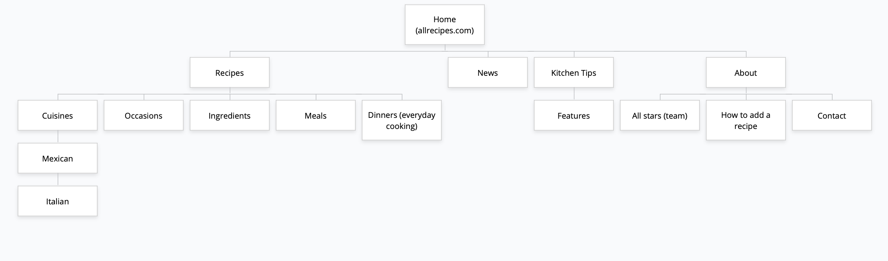
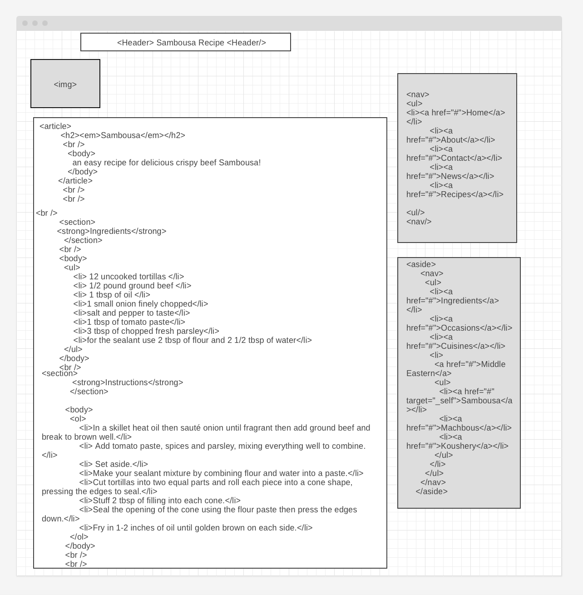

# Week 2 homework (parts one, two, and three)

 ## Part one

## Part two
#### Five Important Considerations for Wireframing article: 
- identifying and understanding the problem 
- sketching and getting the workflow down
- getting early feedback
- getting familiar with your tools/what you like to use
- knowing your audience and how to best build your wireframe to communicate with them
    
## Part three

    

    

